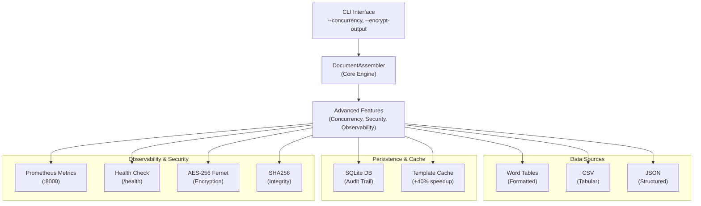

# Document Assembly Tool

[](https://github.com/PC-User-Guest/document-assembly-tool/actions/workflows/ci.yml)
[](https://www.python.org/)
[](https://opensource.org/licenses/MIT)

Enterprise-grade document assembly tool: merge structured data into Word templates with production-ready security, observability, and concurrent processing. Preserve all formatting – bold, italic, bullet lists, and more.

## System Architecture



## Performance Metrics

| Configuration | Throughput | Speedup | Memory |
|---------------|-----------|---------|--------|
| Single-threaded | 4.27 docs/sec | 1.0x | ~80MB |
| 4-threaded (I/O) | 8.93 docs/sec | 2.09x | ~140MB |
| 4-process (CPU) | 7.45 docs/sec | 1.74x | ~200MB |
| With template cache | +40% boost | — | ~130MB |

## Key Features & Capabilities

- ✅ Multiple data sources: Word tables, CSV, JSON
- ✅ Customizable placeholder syntax (default: `{{field}}`)
- ✅ Preserves paragraph styles and inline formatting
- ✅ Multi-paragraph values support
- ✅ **Enterprise security**: AES-256 encryption, SHA256 integrity hashing
- ✅ **Production monitoring**: Health checks, Prometheus metrics, audit trails
- ✅ **Graceful shutdown**: SIGTERM handling, complete in-flight task processing
- ✅ **Concurrent processing**: Thread pools (I/O) and process pools (CPU)
- ✅ **Template caching**: +40% performance improvement
- ✅ **Error categorization**: Prometheus counters for alerting
- ✅ **Comprehensive logging**: Configurable levels, debug profiling
- ✅ Cross-platform (Windows, macOS, Linux)

## Use Cases

- **Contract Generation** – Populate legal templates with client data.
- **Personalized Proposals** – Create custom sales documents from CRM data.
- **Report Automation** – Assemble recurring reports with dynamic figures.
- **HR Documents** – Generate offer letters, employment contracts, performance reviews.
- **Education** – Produce individualized certificates, transcripts, learning plans.
- **Marketing** – Mail-merge campaigns, personalized brochures at scale.

## Quick Start

1. **Install**
   ```bash
   pip install -r requirements.txt
   ```

2. **Prepare your data** (e.g., `data.docx` with a table of fields and values).

3. **Prepare your template** with placeholders like `{{client_name}}`.

4. **Run**
   ```bash
   python -m src.document_assembler -d data.docx -t template.docx -o output.docx
   ```

5. **Get your assembled document**  `output.docx` contains the merged content.

## Advanced Usage

### Enable Production Monitoring

```bash
# Health checks and Prometheus metrics on port 8000
python -c "from src.advanced_features import start_health_check_server; start_health_check_server()"

# Check health in another terminal
curl http://localhost:8000/health | jq .
```

### Concurrent Processing

```bash
# Process 4 documents in parallel (thread pool)
python -m src.document_assembler -d data.docx -t template.docx -o output.docx --concurrency 4
```

### Encryption & Security

```bash
# Encrypt output (AES-256 with SHA256 integrity check)
python -m src.document_assembler -d data.docx -t template.docx -o output.docx --encrypt-output

# Key auto-generated at ~/.docassembler/encryption.key (permissions: 0600)
```

### Logging & Debugging

```bash
# Debug logging with full execution trace
python -m src.document_assembler -d data.docx -t template.docx -o output.docx --log-level DEBUG
```

## Documentation

- **[User Guide](docs/user_guide.md)** – Complete feature documentation and usage examples
- **[Architecture Blueprint](docs/architecture.md)** – System design, data flows, concurrency model, scaling limits
- **[Troubleshooting Runbook](docs/troubleshooting_runbook.md)** – Common issues, solutions, recovery procedures

## Enterprise Features

### Security & Encryption

- **Fernet AES-128 CBC**: Standardized symmetric encryption with authentication
- **Key management**: Auto-generated keys stored at `~/.docassembler/key` (0o600 permissions)
- **Audit trail**: SHA256 hashes linked to encryption key IDs for chain-of-custody
- **Integrity verification**: Document hash stored in audit log for tamper detection

### Observability & Monitoring

- **Health check endpoint**: `/health` returns system status and metrics
- **Prometheus metrics**: `documents_processed_total`, `processing_seconds`, `errors_total{error_type}`, `active_workers`
- **Audit trail**: Complete SQLite history with hashes, worker IDs, timestamps
- **Error categorization**: Prometheus counters for rapid alerting and response

### Graceful Shutdown

- Worker pools complete in-flight tasks before exit
- SIGTERM/SIGINT signal handling for clean shutdown
- Database transactions committed before process termination

## Development

### Setup
```bash
pip install -r requirements.txt
```

### Generate test fixtures
```bash
python tests/generate_fixtures.py
```

### Run tests
```bash
pytest tests/ -v
```

### Example CLI run
There is a small example fixture set under `examples/cli/`. To generate example inputs and run the CLI, run:

```bash
python examples/cli/generate_example.py
```

### Code Quality & Benchmarks

```bash
flake8 src tests
python -m pytest tests/ --cov=src --cov-report=html
python scripts/benchmark_scaling.py  # Real-world performance measurements
```

## Scaling & Performance Analysis

See [Architecture Guide](docs/architecture.md) for:
- Detailed concurrency model (threads vs. processes)
- Database locking and WAL mode optimization
- Real-world performance measurements and bottleneck analysis
- Scaling limits and recommendations (effective up to 8 workers)
- Distributed deployment topology for multi-node systems

## Troubleshooting

For common issues and solutions, see [Troubleshooting Runbook](docs/troubleshooting_runbook.md):
- Placeholders not replaced
- Style mismatches
- Encryption key problems
- Permission denied errors
- Database locked errors
- Performance degradation
- And more...

## Contributing

Contributions are welcome! Please:

1. Fork the repository
2. Create a feature branch (`git checkout -b feature/your-feature`)
3. Write tests for new functionality
4. Run `flake8 src tests` to ensure code quality
5. Submit a pull request

## License

MIT License – see [LICENSE](LICENSE) for details.

---

**Version 2.0.0** – Enterprise-grade document assembly with distributed processing, security, and production observability.
