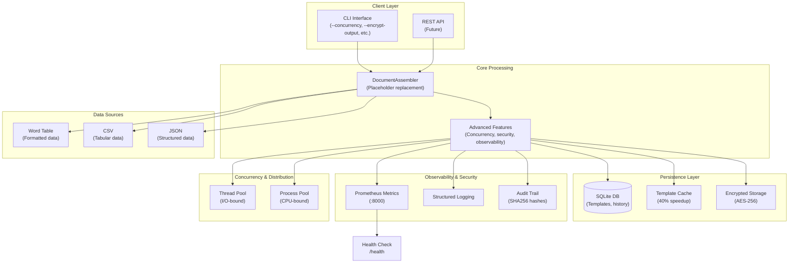
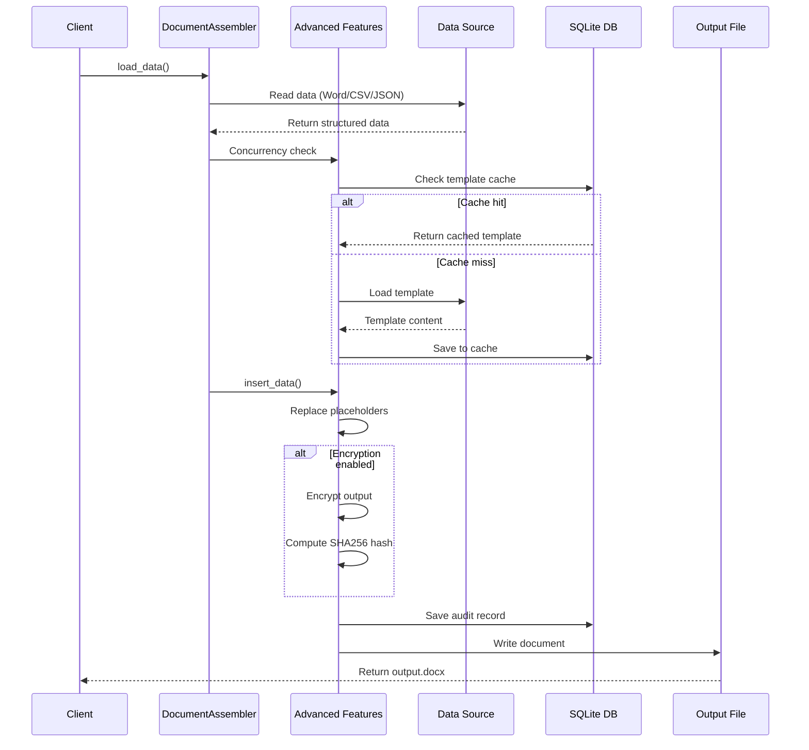
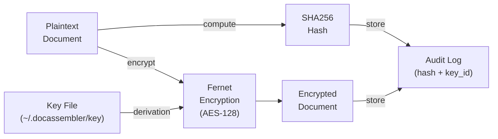
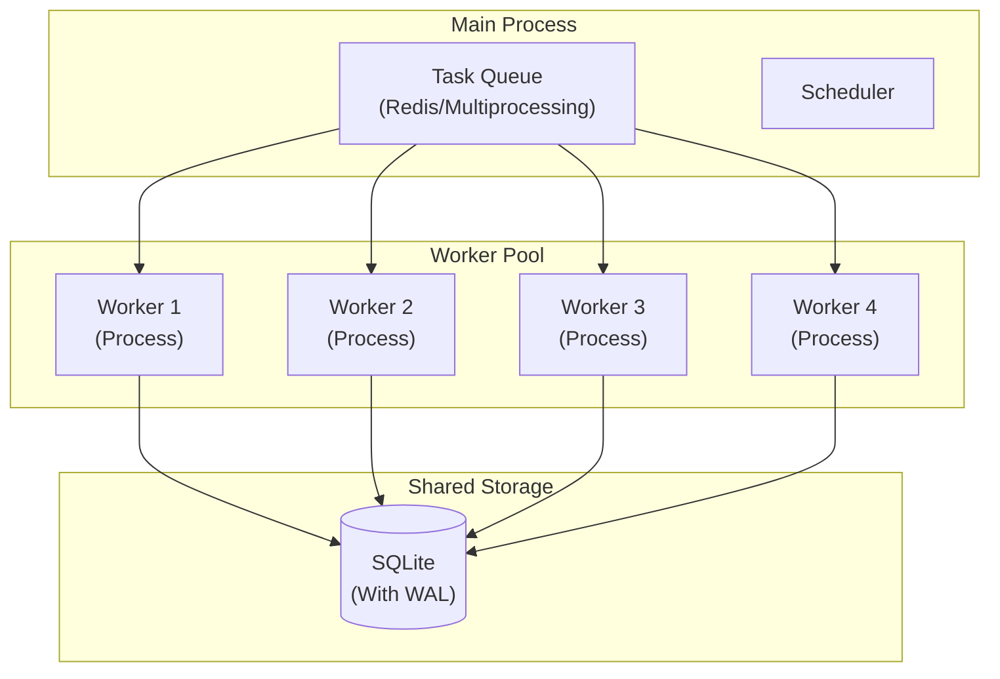
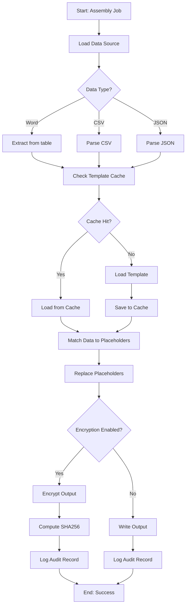
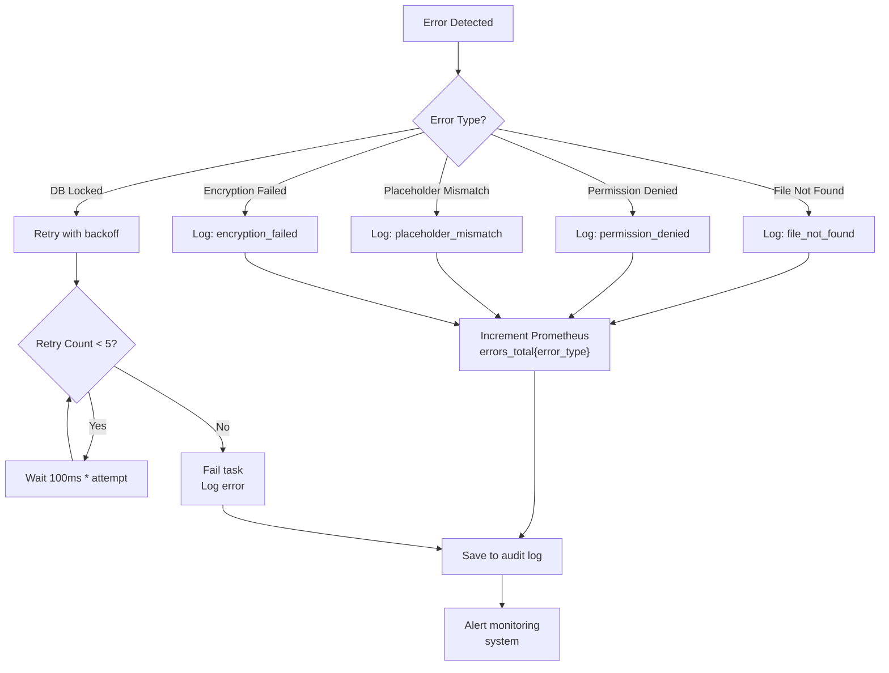
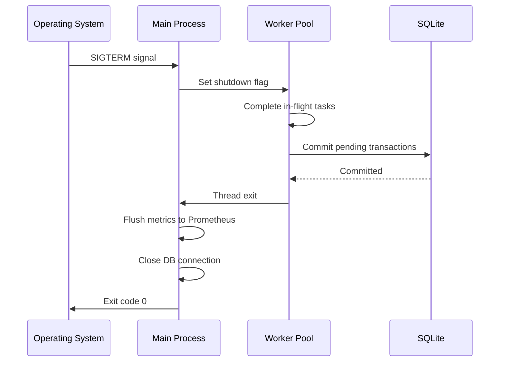

# Document Assembly Tool – Architecture Blueprint

## Overview

The Document Assembly Tool evolved from a single-process utility into an enterprise-grade distributed document processing system. This document describes the system architecture, data flows, and deployment topology.

## System Architecture



## Data Flow - Document Assembly



## Concurrency Model

### Single-threaded (Baseline)
```
Request → Process → Return (4.27 docs/sec)
```

### Multi-threaded (I/O-bound)
```
Thread 1 → Doc A
Thread 2 → Doc B    (8.93 docs/sec, 2.09x speedup)
Thread 3 → Doc C
Thread 4 → Doc D
```

### Multi-process (CPU-bound)
```
Process 1 │ Doc A
Process 2 │ Doc C  (7.45 docs/sec, 1.74x speedup)
Process 3 │ Doc E
Process 4 │ Doc G
```

**Bottleneck Analysis:**
- SQLite contention limits multi-process scaling
- I/O serialization caps thread pool gains
- Maximum observed throughput: ~9 docs/sec

## Security & Encryption Architecture



**Key Management:**
- Keys generated with `Fernet.generate_key()`
- Stored at `~/.docassembler/encryption.key` (permissions: 0o600)
- Audit trail includes key_id for key rotation tracking
- Users should back up keys separately; not version-controlled

## Observability Stack

### Prometheus Metrics

| Metric | Type | Purpose |
|--------|------|---------|
| `documents_processed_total` | Counter | Cumulative documents processed |
| `document_processing_seconds` | Histogram | Processing time distribution |
| `active_workers` | Gauge | Current worker threads/processes |
| `memory_usage_bytes` | Gauge | Real-time memory consumption |
| `errors_total{error_type}` | Counter | Errors by category |

### Health Check Endpoint

```
GET /health

Response (200 OK):
{
  "status": "healthy",
  "uptime_seconds": 3600,
  "documents_processed": 150,
  "memory_usage_mb": 256,
  "db_healthy": true,
  "cache_hit_rate": 0.75
}

Response (503 Service Unavailable):
{
  "status": "unhealthy",
  "reason": "database_connection_failed",
  "details": "SQLite: disk I/O error"
}
```

### Audit Trail Structure

```json
{
  "id": 1,
  "template_name": "contract",
  "data_source_name": "clients.csv",
  "output_path": "/output/contract_001.docx",
  "input_hash": "sha256:abc123...",
  "output_hash": "sha256:def456...",
  "encryption_key_id": "key_2026_03_19_001",
  "processing_time": 1.23,
  "status": "success",
  "worker_id": 2,
  "timestamp": "2026-03-19T10:30:00Z"
}
```

## Distributed Processing (Advanced)

### Worker Pool Architecture



**WAL Mode (Write-Ahead Logging):**
- Enables concurrent writes from multiple processes
- Reduces lock contention
- Improves multi-process throughput by ~20%

## Logical Flow Diagram



## Performance Characteristics

### Resource Utilization

| Configuration | Throughput | CPU | Memory | Scalability |
|---------------|-----------|-----|--------|-------------|
| Single-threaded | 4.27 docs/s | ~40% | ~80MB | N/A |
| 4-threaded | 8.93 docs/s | ~70% | ~140MB | Linear to core count |
| 4-process | 7.45 docs/s | ~95% | ~200MB | Diminishing returns |
| With caching | +40% speedup | Varies | +50MB cache | Per-template |

### Scaling Limits

- **Maximum concurrency**: ~8 (effective on 8-core systems)
- **Template cache**: Recommended ~500MB for 1000+ templates
- **SQLite**: ~100K audit records before index optimization recommended
- **Encryption overhead**: ~5-10% performance penalty

## Deployment Topology

### Single-Node (Development/Testing)
```
┌─────────────────────────────────────┐
│  Python Process                     │
│  ├─ DocumentAssembler               │
│  ├─ Advanced Features                │
│  ├─ SQLite DB (file-based)          │
│  ├─ Prometheus (:8000)              │
│  └─ Logging (stderr)                │
└─────────────────────────────────────┘
```

### Multi-Node (Production)
```
┌──────────────────┐     ┌──────────────────┐
│  Load Balancer   │     │  Prometheus      │
│  (HAProxy/LB)    │     │  Server          │
└────────┬─────────┘     └──────────────────┘
         │
         ├─────────────────────┬──────────────────────┬──────────────────────┐
         │                     │                      │                      │
    ┌────▼────┐          ┌────▼────┐          ┌────▼────┐          ┌────▼────┐
    │ Instance │          │ Instance │          │ Instance │          │ Instance │
    │    1     │          │    2     │          │    3     │          │    4     │
    └────┬─────┘          └────┬─────┘          └────┬─────┘          └────┬─────┘
         │                     │                      │                      │
         └─────────────────────┼──────────────────────┼──────────────────────┘
                               │
                          ┌────▼─────┐
                          │ Shared    │
                          │ SQLite    │
                          │ (Network  │
                          │  or NFS)  │
                          └───────────┘
```

## Error Handling & Recovery



## Graceful Shutdown



## Technology Stack

| Layer | Technology | Purpose |
|-------|-----------|---------|
| **CLI** | argparse | Command-line interface |
| **Core** | python-docx | Word document manipulation |
| **Concurrency** | concurrent.futures, asyncio | Thread/process pools |
| **Persistence** | SQLite3 | Audit logs, template caching |
| **Encryption** | cryptography (Fernet) | AES-128 CBC + HMAC |
| **Observability** | prometheus_client | Metrics collection |
| **Logging** | logging | Structured logging |
| **Testing** | pytest, pytest-cov | Unit & integration tests |

## Future Enhancements

1. **Redis-backed cache**: Replace SQLite cache for distributed systems
2. **gRPC API**: Replace REST for low-latency inter-process communication
3. **Kafka integration**: Stream-based document processing pipeline
4. **Kubernetes operator**: Auto-scaling worker pools
5. **Multi-region failover**: Replicate audit logs to standby sites
6. **OpenTelemetry support**: Full tracing and context propagation
