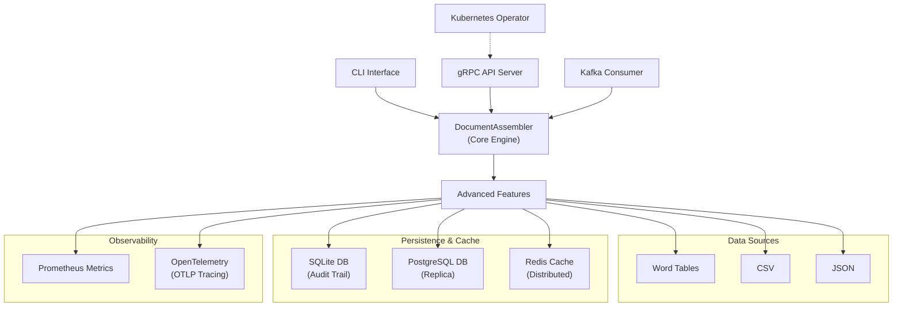
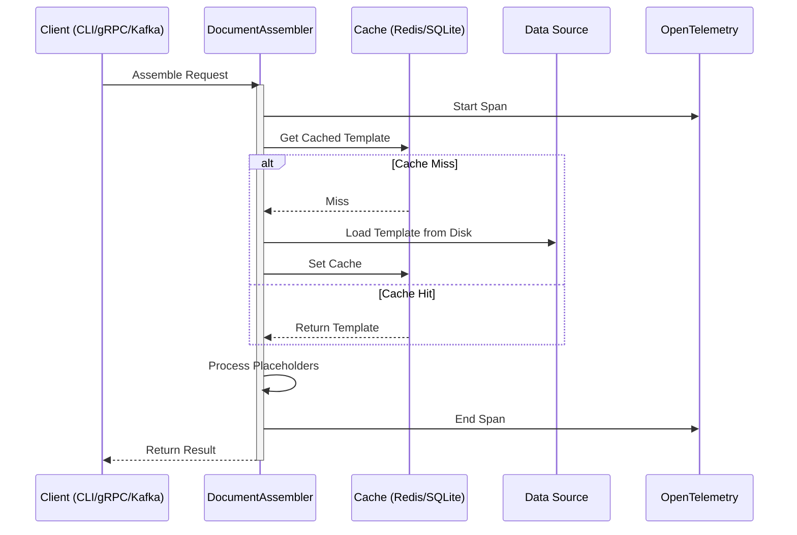
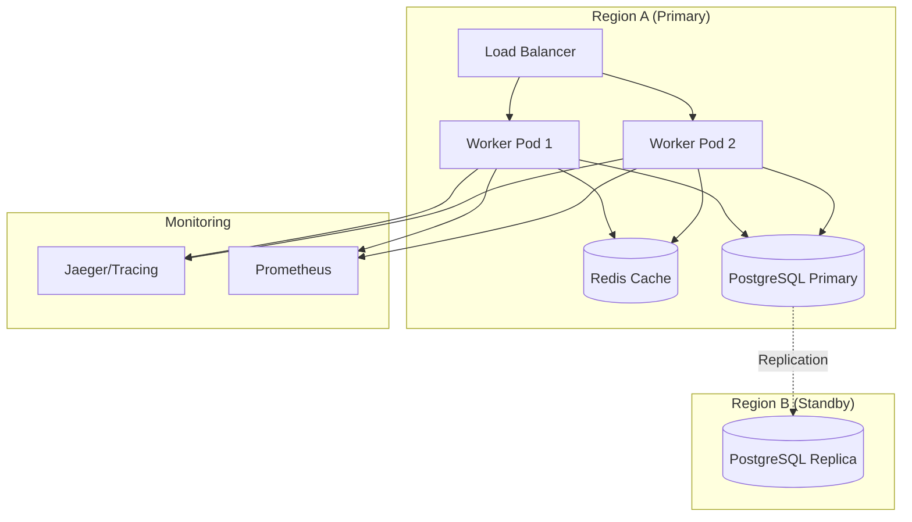

# Architecture Blueprint

## System Architecture

## Core Components

### 1. DocumentAssembler
The core engine responsible for loading data, parsing templates, and performing placeholder replacement. Now instrumented with OpenTelemetry spans for performance profiling.

### 2. Cache Layer
Supports both local SQLite and distributed Redis backends. Templates are cached as serialized blobs keyed by SHA256 hashes of the file content.

### 3. API & Integration
- **gRPC API**: Low-latency interface for inter-process communication, supporting single and batch assembly.
- **Kafka Consumer**: Stream-based processing for high-throughput asynchronous workloads.
- **CLI**: Feature-rich command-line tool for manual and scripted operations.

### 4. Persistence & Failover
Audit logs are written to a primary backend (SQLite or PostgreSQL) and can be asynchronously replicated to standby sites for disaster recovery.

### 5. Kubernetes Operator
Managed via Kopf, the operator watches for `DocumentAssemblyJob` custom resources and auto-scales worker deployments based on backlog metrics from Prometheus.

## Data Flow

## Deployment Topology (Distributed)

## Technology Stack

| Layer | Technology |
|-------|------------|
| **Core** | Python 3.10+, python-docx |
| **API** | gRPC, Protobuf |
| **Streaming** | Apache Kafka |
| **Cache** | Redis, SQLite |
| **Persistence** | PostgreSQL, SQLite |
| **Observability** | Prometheus, OpenTelemetry |
| **Orchestration** | Kubernetes, Kopf, Helm |
